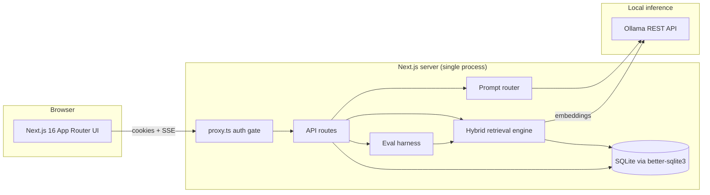

# Prism — Privacy-First Local LLM Hub

**Chat with local models over your own documents — with hybrid RAG, built-in retrieval evals, and zero cloud calls.**

### [→ Try the interactive demo](https://d1eau8jaupf0cp.cloudfront.net)

The demo runs the real interface with recorded responses, so you can explore
chat, citations, benchmarking, and the eval suite without installing anything.
Ask about the rate limit, the deploy process, or the November incident to see
retrieval with working citations.

Prism is a self-hosted hub for small language models running on [Ollama](https://ollama.com). Every token is generated on your machine, every document stays in a local SQLite file, and the retrieval pipeline that answers questions about your files can *prove* it works with a self-generating evaluation suite.

---

## Why

Cloud LLM tools ask you to upload your contracts, medical records, and codebases to someone else's computer. Prism's answer: run capable small models locally and give them the retrieval infrastructure that usually only cloud RAG products have — hybrid search, reranking, citations, and eval metrics — with **zero external network calls**.

## Features

| Feature | What's underneath |
|---|---|
| **Chat with smart routing** | Classifies each prompt (code / reasoning / general) and routes to the best installed model, with manual override |
| **Document Q&A (RAG)** | PDF/text ingestion → paragraph-aware chunking with overlap → local embeddings → hybrid retrieval with inline citations |
| **Hybrid retrieval** | Dense vector search (cosine over Ollama embeddings) **+** BM25 lexical scoring, fused with Reciprocal Rank Fusion, de-duplicated with Maximal Marginal Relevance |
| **Retrieval evals** | Synthetic test-set generation (a local model writes questions from your own chunks) and Hit@1 / Hit@K / MRR / latency reporting |
| **Model benchmark** | Stream the same prompt through up to 6 models in parallel; compare tok/s, latency, and output side by side |
| **Knowledge collections** | Group documents into named corpora and attach a whole collection to a chat |
| **Prompt library** | Reusable system/user prompts, insertable mid-chat |
| **Global search** | `⌘K` across sessions, messages, documents, prompts, and collections |
| **Programmatic API** | `POST /api/v1/chat` with hashed API keys (SSE streaming or JSON) |
| **Telemetry dashboard** | Live tok/s, latency, token counts, and per-model usage |
| **Multi-user auth** | scrypt password hashing, HMAC-signed session tokens, login rate limiting, token-version session invalidation, per-user data isolation |

## Architecture



### The retrieval pipeline

```
document ──► chunk (paragraph-aware, ~400 tok, 60 tok overlap)
         ──► embed (nomic-embed-text via Ollama, stored in SQLite)

query ──► embed ──► cosine similarity ─┐
      ──► BM25 (Okapi, k1=1.5, b=0.75) ─┤──► Reciprocal Rank Fusion (k=60)
                                        └──► MMR selection (λ=0.7)
                                             ──► top-K chunks + citations
```

Why hybrid? Dense retrieval understands *meaning* ("throttling policy" ≈ "rate limit") but misses exact tokens — error codes, function names, invoice numbers. BM25 nails exact terms but has no semantics. RRF merges both rankings without score calibration, and MMR keeps the final top-K from being five near-copies of the same paragraph.

### Measuring it: the eval harness

Instead of hand-labeling a test set, Prism samples chunks evenly across your corpus and asks a local model to write one question each chunk uniquely answers. The source chunk is the ground-truth label. Running the suite reports:

- **Hit@1 / Hit@K** — how often the right document ranks first / in the top K
- **MRR** — mean reciprocal rank of the first correct hit
- **Latency** — per-query retrieval time

All generated and scored locally; no external eval service.

## Security model

- **AUTH_SECRET enforced** — the server refuses to start in production without a real secret
- **scrypt** password hashing with per-user salt and timing-safe comparison
- **HMAC-SHA256 signed session cookies** (`HttpOnly`, `SameSite=Lax`, `Secure` in prod)
- **Token versioning** — changing a password bumps a per-user version, instantly invalidating every other session
- **Login rate limiting** — sliding window, 10 attempts per username per 15 minutes
- **Per-route auth** — every API route validates the session server-side (the middleware gate alone is not trusted)
- **API keys** stored as SHA-256 hashes; the plaintext key is shown exactly once
- **Audit log** of security-relevant events (admin-only)

## Demo mode

Prism runs models on your own hardware, so it can't be hosted as a live service —
there is no model waiting on a server. Demo mode solves that: it runs the real
interface with recorded responses, so the product can be explored without
installing anything.

```bash
npm run dev:demo
```

A client-side layer patches `fetch` and answers every `/api/*` call from fixtures,
so **no component knows it is in demo mode** — the same code paths run against
canned data. Chat and benchmark responses are re-streamed token by token through
real `ReadableStream`s, so streaming, routing, citations, and the live tok/s
counters all behave as they do against Ollama.

The demo corpus is three internal documents for a fictional company. Asking about
the rate limit, the deploy process, or the November incident returns grounded
answers with working citations.

Build a static demo bundle with `npm run build:demo:static` (output lands in `out/`).

## Deploying the demo

The demo is the only part that gets hosted — see
[ADR 0001](docs/adr/0001-hosting-the-demo-not-the-app.md) for why the app stays
local. Infrastructure lives in [`infra/`](infra/README.md) as Terraform:

- Private, encrypted S3 bucket fronted by CloudFront through an Origin Access Control, so the bucket is never publicly readable
- A CloudFront Function rewriting directory URLs onto their `index.html`
- GitHub Actions publishing via **OIDC role assumption** — no AWS access key is stored in repository secrets, and the role is pinned to a single repo and branch
- Cache headers split so hashed assets are immutable while HTML always revalidates

It runs inside the always-free tier: CloudFront allows 1 TB of egress per month
and the bundle is roughly 2.4 MB. No compute, no NAT gateway, no custom domain.

## Getting started

**Prerequisites:** Node 20+, [Ollama](https://ollama.com) with at least one chat model and one embedding model:

```bash
ollama pull llama3.2          # chat
ollama pull nomic-embed-text  # embeddings
```

**Run:**

```bash
git clone <this repo> && cd prism
npm install
npm run dev
```

Open http://localhost:3000 — the first account you create becomes admin.

**Production:**

```bash
export AUTH_SECRET=$(openssl rand -hex 32)   # required — startup fails without it
npm run build && npm start
```

## API

```bash
curl -N http://localhost:3000/api/v1/chat \
  -H "Authorization: Bearer prism_<your-key>" \
  -H "Content-Type: application/json" \
  -d '{"message": "Summarize the attached corpus", "stream": true}'
```

Keys are created in **Settings → API Keys**.

## Stack

| Layer | Choice | Why |
|---|---|---|
| Framework | Next.js 16 (App Router, Turbopack) | Single process serves UI + API; SSE streaming from route handlers |
| Storage | SQLite via better-sqlite3 | Zero-ops, synchronous reads, versioned migrations via `PRAGMA user_version` |
| Inference | Ollama REST API | Local models, streaming, embeddings — one dependency for all of it |
| Retrieval | Hand-rolled BM25 + RRF + MMR | No vector-DB dependency; the whole pipeline is ~200 readable lines |
| UI | Tailwind CSS 4 + shadcn/ui + Recharts | |

## Design notes

The visual identity comes from the name: a prism disperses one beam into a spectrum, the way the router disperses one prompt across models. That idea appears as a single spectral hairline — under the logo and as the dashboard header rule — on an otherwise disciplined violet-cast dark theme. Metric values are set in tabular mono; icons stay monochrome.

---

*Built as a demonstration of production-grade RAG engineering: hybrid retrieval, measurable quality, and a security model that treats local-first as a feature, not an excuse.*
